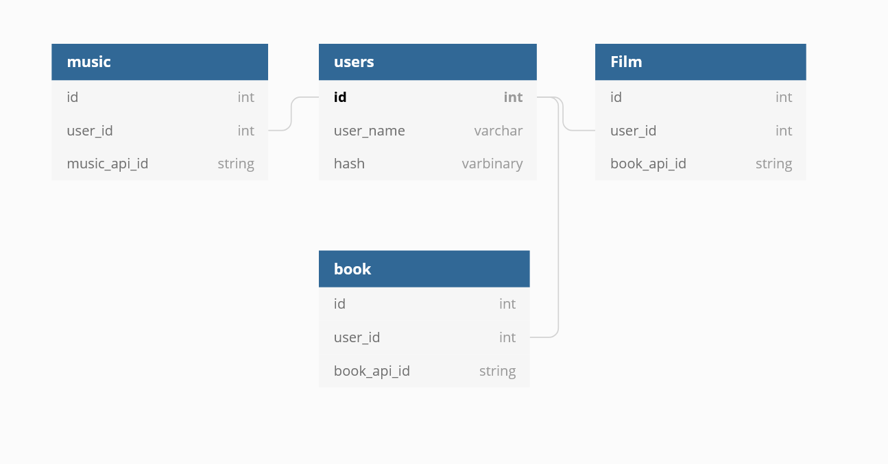

# Liszt
Tai, Tom, Crystal, Kenneth, Al

## Lizst is a personal media journal, where you can search for your favourite films, music, and books to add to your recommendation list.

## User Stories
As a user, I want to register for an account

As a user, I want to login to my account 

As a user, I want to see media categories on my profile page  

As a user, I want to be able to search for items in each category

As a user, I want view the results when I search a title

As a user, I want to be able to add an item from my search to my list 

As a user I want to remove my items from my list  

As a user, I would like to use the app on my mobile device

### Developer Stories

As a system I want to use an external API for my app 

As a system I want to be able to interact with a DB 

As a system I want to add items from list a DB  

As a system I want to remove items from list a DB 

As a system I want to update items from list in a DB 

As a system I want a DB that holds the user's account /name/id 


## Code of Conduct
### Expectation setting:

Work hours 9:00am - 6:00pm. We will aim to wrap up around 6:00pm. (7:00pm max!)

Saturday 10:30am - 3:00pm.

### Stress management & wellbeing:
Al: Needs to reach out for help when stuck, technically or emotionally. Maintain honesty and openness.

Crystal: Requires honest and efficient communication from team mates. Needs breaks.

Kenneth: Needs reassurance and help.

Tai: Needs team mates to offer help, and prompts to take a break.

Tom: Needs regular communication where each team member is at. Appreciates check ins on stress.

### Conflict management:
The team is a democracy. Decisions are made by concensus.

When conflict arises, every member will acknowledge it.

We have agreed that conflict is not to be taken personally, and we can benefit from ironing issues out quickly.

Reduce potential instances of conflict by mainting accountability for our work.

Show empathy.

### Communication:
We will strive to maintain high and open communication.

### How we will work:
We will adopt Agile team principles as a loose guideline for our roles. Each day someone will have the opportunity to step into Scrum Master. Each member has an obligation to communicate regularly and will take on 'Vibes lead'. Tasks will be broken down to small and clear areas of ownership. We will track our tasks via ticketing and assigning fibonacci values to represent their difficulty.

### Getting help:
We have established a system for helping each other and reaching out to our facilitators for help.

We will use previous code examples, google searches, and youtube tutorials to help us get to where we need to be.

When we are stuck and our team is unable to help each other we will concisely sum up our area of struggle with a well thought out question, outlining the approaches we have undertaken to efficiently reach a solution. 

We have acknowledged that approaching team members is not considered interrupting. 

## Stretch
Category list to have two categories, one for 'have watched', one for 'to watch'

Ability to move items between 'have watched' and 'to watch'

Add notes to items on list

'Date added' visible for each item on list

Pin categories to profile page

Category button displays images of items in list

Items in list decend by order of relevancy

Apply themed styling

Delete account

### Database Diagram

[Liszt ERD on dbdiagram.io](https://dbdiagram.io/d/5fc98d333a78976d7b7e743b)

## Git Policy
How to merge (e.g. Feature branch to front-end)
1. On feature-branch, git pull origin front-end
2. If conflicts, deal with them.
3. Commit and push if you've needed to make changes.
4. git checkout front-end
5. git merge feature-branch
6. Once that's successful, git push origin front-end

#### Feature branches
- Roughly aligns to a ticket being worked on solo, or by a pair
- Need to be code reviewed before getting merged into front-end or back-end.

#### front-end, back-end, 
Feature branches get merged into here. The idea of these branches is that if front-end code is working and needs to go to dev and main, it isn't blocked by some back-end changes that aren't working. Or vice versa

#### dev
We really don't want this one broken, but it's better here than in Main.

#### main
Only integrated, working code can go in here. Don't want it broken.

## API Routes

### `GET /api/v1/books/:userId`

Response (200):

```json
{
	"books": [
		{
			"bookApiId": "1bMXAAAAYAAJ",
			"imageUrl": "http://books.google.com/books/content?id=1bMXAAAAYAAJ&printsec=frontcover&img=1&zoom=1&edge=curl&source=gbs_api"
		}
	]
}
```
